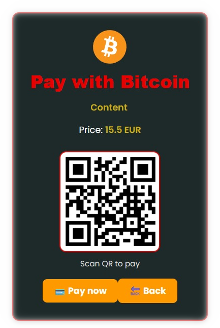

# Betty Bitcoin-payment

  

**Betty** Bitcoin Payment on Bitcoin-maksupalvelu, joka on rakennettu **Node.js:n** ja **Reactin** avulla.

Projekti tarjoaa taustajärjestelmän API Bitcoin-maksupyyntöjen luomiseen ja hallintaan.
React-asiakasohjelmaa käytetään maksupalvelun **käyttöliittymänä**.

### 💳 Maksaminen

Palvelun avulla voidaan:

* ₿ Luoda Bitcoin-maksupyyntö tietylle summalle ja viitteelle.
* ₿ Luoda maksulle yksilöllinen maksutunniste.
* ₿ Kauppias voi luoda maksupyynnön asiakkaalle.
* ₿ Asiakas voi maksaa maksupyynnön Bitcoinilla.
* ₿ Maksun tilaa voidaan seurata maksutunnisteen avulla.
* ₿ Maksun vahvistuttua maksun tila voidaan päivittää.
* ₿ Kauppiaan ominaisuudet 
<ul>
    <ul>
      <li>Luo uusi maksupyyntö</li>
      <li>Määritä maksun summa</li>
      <li>Lisää viite tai kuvaus</li>
      <li>Luo yksilöllinen payment ID</li>
      <li>Tarkista maksun tila</li>
      <li>Tarkastele luotuja maksuja</li>
      <li>Välitä maksupyyntö asiakkaalle</li>
      <li>Maksun vahvistuttua maksun tila voidaan päivittää</li>
    </ul>
  </li>
</ul>

* ₿ Asikkaan ominaisuudet 
<ul>
    <ul>
 <li>
 Avaa kauppiaan luoman maksupyynnön</li>
  <li>Tarkastele maksettavaa summaa</li> 
  <li>Tarkastele maksun viitettä tai kuvausta</li> 
  <li>Tarkastele maksun yksilöllistä payment ID:tä</li>
   <li>₿ Suorita Bitcoin-maksu</li>
   <li> Kopioi maksutiedot Bitcoin-lompakkoon</li>
    <li> Tarkista maksun tila</li> 
    <li> Tarkastele maksun vahvistumista</li>
     </ul>
     </ul>

 🛠️ Teknologiat
* Node.js - backend
* React - client
* REST - API
* Bitcoin




## 🔌 Payment API

Backendin REST API tarjoaa rajapinnan maksupyyntöjen luomiseen ja
yksittäisten maksujen hakemiseen


```text
POST /api/payments
        ↓
Create payment
        ↓
Store payment
        ↓
Return payment

GET /api/payments/:id
        ↓
Find payment
        ↓
Return payment
```

## 🏗️ Arkkitehtuuri
Lopputulos pystytään tarkistamaan Bitcoin-verkosta:

```text
                   Internet
                       │
                       ▼
                HTTPS / Domain
                       │
                 ┌─────▼─────┐
                 │  Nginx /  │
                 │  Reverse  │
                 │   Proxy   │
                 └─────┬─────┘
                       │
                       ▼
                Node.js API
                       │
              ┌────────┴────────┐
              ▼                 ▼
          PostgreSQL       Bitcoin service

```
## Bitcoin-node

Voidaan käyttää Bitcoin-infrastruktuurin APIa, jolloin meidän backendin tehtäväksi jää:

* maksupyynnöt
* osoitteet
* maksujen seuranta
* transaktioiden validointi
* status
* tietokanta

... tai vaihtoehtoisesti **omaa** Bitcoin-nodeen.

### 🔗 Oma Bitcoin-node
```text
Bitcoin Network
       │
       ▼
   Bitcoin Node
       │
 ┌─────┴─────┐
 │           │
P2P         RPC
 │           │
 ▼           ▼
Peers      Your App
             │
             ▼
       Bitcoin payment

```
Oma node omassa apissa käytsössä:

```text
Customer
   │
   │ BTC payment
   ▼
Bitcoin Network
   │
   ▼
Your Bitcoin Node
   │
   │ RPC / ZMQ
   ▼
Bitcoin-payment Backend
   │
   ▼
Payment confirmed

```

## 📄 License

**Coderinna Proprietary License 1.0**

This project is proprietary software owned by **Coderinna**.

No rights are granted to copy, modify, distribute, sublicense, sell, or create derivative works from this project.

Commercial, organizational, corporate, hosted, SaaS, and other third-party use is **not permitted** without prior written permission from Coderinna.

All rights are reserved unless explicitly granted in writing.

For the complete terms, see the [`LICENSE`](./LICENSE) file.
